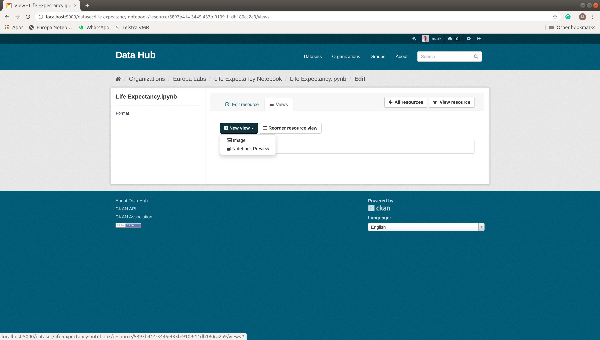
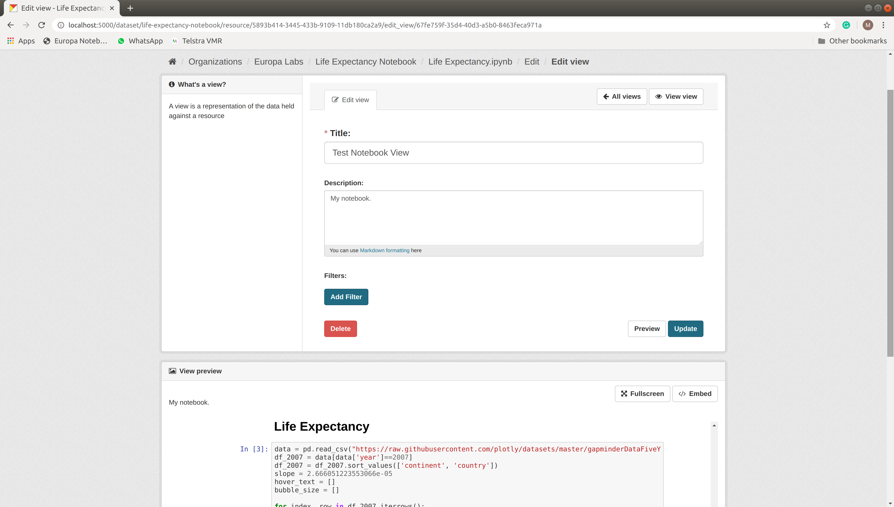
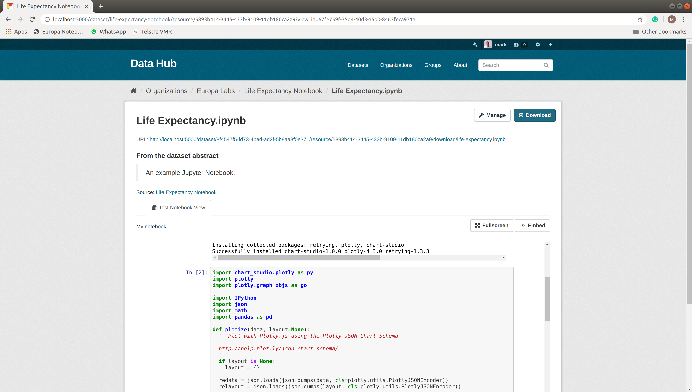

.. image:: https://travis-ci.org/markmo/ckanext-nbview.svg?branch=master
  :target: https://travis-ci.org/markmo/ckanext-nbview

.. image:: https://coveralls.io/repos/markmo/ckanext-nbview/badge.svg
  :target: https://coveralls.io/r/markmo/ckanext-nbview

..  .. image:: https://pypip.in/download/ckanext-nbview/badge.svg
        :target: https://pypi.python.org/pypi//ckanext-nbview/
        :alt: Downloads

..  .. image:: https://pypip.in/version/ckanext-nbview/badge.svg
        :target: https://pypi.python.org/pypi/ckanext-nbview/
        :alt: Latest Version

..  .. image:: https://pypip.in/py_versions/ckanext-nbview/badge.svg
        :target: https://pypi.python.org/pypi/ckanext-nbview/
        :alt: Supported Python versions

..  .. image:: https://pypip.in/status/ckanext-nbview/badge.svg
        :target: https://pypi.python.org/pypi/ckanext-nbview/
        :alt: Development Status

..  .. image:: https://pypip.in/license/ckanext-nbview/badge.svg
        :target: https://pypi.python.org/pypi/ckanext-nbview/
        :alt: License

=============
ckanext-nbview
=============

A CKAN Resource View plugin to display a read-only view of a Jupyter Notebook.

**Create Notebook View**

**Edit Notebook View**

**Show Notebook View**

------------
Requirements
------------

Tested with CKAN Version 2.8.3.

------------
Installation
------------

To install ckanext-nbview:

1. Activate your CKAN virtual environment, for example::

     . /usr/lib/ckan/default/bin/activate

2. Install the ckanext-nbview Python package into your virtual environment::

     pip install ckanext-nbview

3. Add ``nbview`` to the ``ckan.plugins`` setting in your CKAN
   config file (by default the config file is located at
   ``/etc/ckan/default/production.ini``).

4. Restart CKAN. For example if you've deployed CKAN with Apache on Ubuntu::

     sudo service apache2 reload

   or for local development::

     paster serve --reload /etc/ckan/default/development.ini

---------------
Config Settings
---------------

The following config setting is required, e.g. in ``/etc/ckan/default/development.ini``
under ``[app:main]``::

    # The nbviewer service url, just scheme, host and port. Leave off 
    # the trailing slash.
    ckan.nbview.nbviewer_host = http://localhost:8080

------------------------
Development Installation
------------------------

To install ckanext-nbview for development, activate your CKAN virtualenv and
do::

    git clone https://github.com/markmo/ckanext-nbview.git
    cd ckanext-nbview
    python setup.py develop
    pip install -r dev-requirements.txt

-----------------
Running the Tests
-----------------

To run the tests, do::

    nosetests --nologcapture --with-pylons=test.ini

To run the tests and produce a coverage report, first make sure you have
coverage installed in your virtualenv (``pip install coverage``) then run::

    nosetests --nologcapture --with-pylons=test.ini --with-coverage --cover-package=ckanext.nbview --cover-inclusive --cover-erase --cover-tests

---------------------------------
Setup dev instance of nbviewer
---------------------------------

Run nbviewer as a Docker container::

    docker pull jupyter/nbviewer

    docker run --network="host" \
      -p 8080:8080 \
      -v /home/mark/src/europalabs/nbviewer_templates:/data/nbviewer_templates \
      -e 'NBVIEWER_TEMPLATE_PATH=/data/nbviewer_templates' \
      jupyter/nbviewer

``--network="host"`` means that references to ‘localhost’ in the container 
refer to the host.

We can override templates in nbviewer by putting jinja2 templates into the 
directory at ``NBVIEWER_TEMPLATE_PATH``, which can be on the host and mapped 
to a volume in the container.

We override the ``layout.html`` template to remove the navbar and show just 
the notebook.

See https://learning.oreilly.com/videos/advanced-jupyter-notebook/9781771375665/9781771375665-video239340

---------------------------------
Install from this GitHub Repo
---------------------------------

ckanext-nbview can be installed using::

  pip install git+https://github.com/markmo/ckanext-nbview#egg=ckanext-nbview

----------------------------------------
Releasing a New Version of ckanext-nbview
----------------------------------------

ckanext-nbview is availabe on PyPI as https://pypi.python.org/pypi/ckanext-nbview.
To publish a new version to PyPI follow these steps:

1. Update the version number in the ``setup.py`` file.
   See `PEP 440 <http://legacy.python.org/dev/peps/pep-0440/#public-version-identifiers>`_
   for how to choose version numbers.

2. Create a source distribution of the new version::

     python setup.py sdist

3. Upload the source distribution to PyPI::

     python setup.py sdist upload

4. Tag the new release of the project on GitHub with the version number from
   the ``setup.py`` file. For example if the version number in ``setup.py`` is
   0.0.2 then do::

       git tag 0.0.2
       git push --tags

---------------------------------
Registering ckanext-nbview on PyPI
---------------------------------

ckanext-nbview should be availabe on PyPI as
https://pypi.python.org/pypi/ckanext-nbview. If that link doesn't work, then
you can register the project on PyPI for the first time by following these
steps:

1. Create a source distribution of the project::

     python setup.py sdist

2. Register the project::

     python setup.py register

3. Upload the source distribution to PyPI::

     python setup.py sdist upload

4. Tag the first release of the project on GitHub with the version number from
   the ``setup.py`` file. For example if the version number in ``setup.py`` is
   0.0.1 then do::

       git tag 0.0.1
       git push --tags

----------------------------------------
Releasing a New Version of ckanext-nbview
----------------------------------------

ckanext-nbview is availabe on PyPI as https://pypi.python.org/pypi/ckanext-nbview.
To publish a new version to PyPI follow these steps:

1. Update the version number in the ``setup.py`` file.
   See `PEP 440 <http://legacy.python.org/dev/peps/pep-0440/#public-version-identifiers>`_
   for how to choose version numbers.

2. Create a source distribution of the new version::

     python setup.py sdist

3. Upload the source distribution to PyPI::

     python setup.py sdist upload

4. Tag the new release of the project on GitHub with the version number from
   the ``setup.py`` file. For example if the version number in ``setup.py`` is
   0.0.2 then do::

       git tag 0.0.2
       git push --tags
